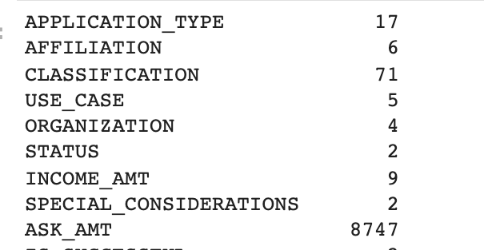
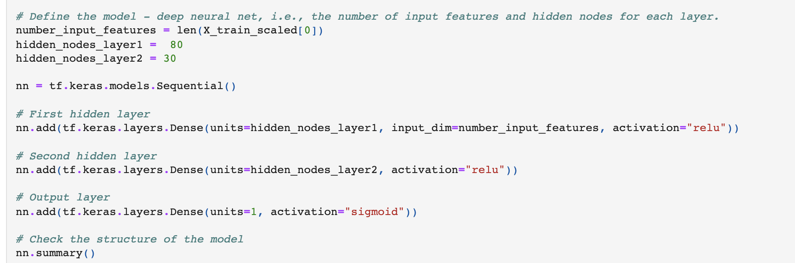
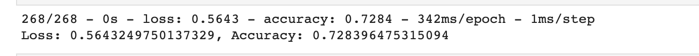

# Neural_Network_Charity_Analysis

## Overview of the analysis.

The porpouse  of this analysis is to create a  model that helps predict whether applicants will be successful if  Alphabet Soup gives them a loan. The dataset includes more than 34,000 organizations that have received funding from Alphabet Soup over the years.

## Results.

- Data Preprocessing

    - What variable(s) are considered the target(s) for your model?
    The IS_SUCCESSFUL column

    - What variable(s) are considered to be the features for your model?
     APPLICATION_TYPE, AFFILIATION, CLASSIFICATION, USE_CASE, ORGANIZATION, STATUS, INCOME_AMT, SPECIAL_CONSIDERATIONS, and ASK_AMT.

    - What variable(s) are neither targets nor features, and should be removed from the input data?
    EIN and NAME

## Compiling, Training, and Evaluating the Model

    - How many neurons, layers, and activation functions did you select for your neural network model, and why?
    For the first layer I used 80 and for the second 30, both have activation function "relu" & the output layer is "sigmoid"

    - Were you able to achieve the target model performance?

    No. the accuracy was 72.8%

    - What steps did you take to try and increase model performance?
    I changed the frist layer to 50 and the secont to 20. This improved accuracy by .1%

## Sumnmary.

After a lot of testing I ended up with a model that has almost %73 accuracy which is a good number but is not the expected %75. Another approach might be needed, like trying another model like a random forest or it may be that we need a little more data to be more precise.